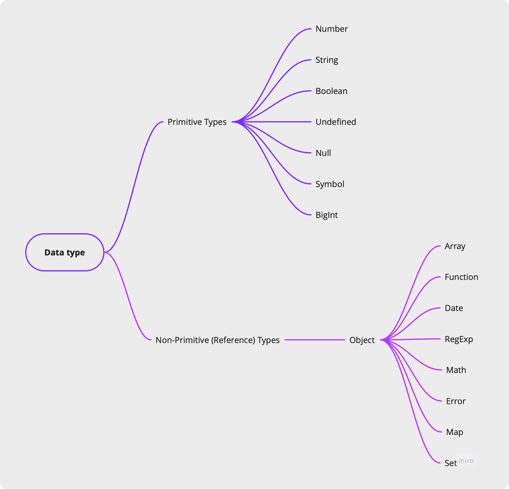

# Data Types

> [!NOTE]
> **What is a Data Type?**
> In computer science and computer programming, a data type or simply type is an attribute of data which tells the compiler or interpreter how the programmer intends to use the data.




## Primitive Types

There are a few different types of data we can store in variables.

### Numbers
A number data type can be an integer, a floating point value, an exponential value, a `NaN` (Not-a-Number) or a `Infinity`.

- A `NaN` results when we try to perform an operation on a number with a non-numeric value
- If a number is divided by 0, the resulting value is `Infinity`.
- JavaScript has a `parseInt()` and `parseFloat()` function to convert strings to numbers.

> [!NOTE]
> `Infinity` in JavaScript is a special number with an interesting property: it's bigger than any finite number.

&nbsp; 

### Null
The null in JavaScript is a data type that is represented by only one value, the ‘null’ itself. A null value means no value.
```jsx
var a = null;
console.log(a);   // This returns null
```

&nbsp; 

### Boolean
The boolean data type has only two values, true and false. It is mostly used to check a logical condition.

- Booleans are returned as-is.
- undefined turns into `false`.
- null turns into `false`.
- 0, -0, and `NaN` turn into `false`; other numbers turn into `true`.
- 0n turns into `false`; other BigInts turn into `true`.
- Symbols turn into `true`.
- All objects become `true`.

&nbsp; 

### Symbol
The symbol data type defines a property of an object which is private to the object. It refers to the ‘key’ of the key-value pair of an object.

```jsx
var object1 = {
   name: ‘Shalini’,
   age: 25,
   city: ‘Mumbai’
}
var occupation = Symbol(‘engineer’);
```

_The function `Symbol()` is used to create a new symbol. Here we have created a symbol ‘occupation’ with the value ‘engineer’ for the above object ‘object1’._

**Every symbol is unique**. Two Symbols even with the same key values are not same.
```jsx
var occupation=Symbol(‘engineer’); 
var occupation=Symbol();

occupation===occupation // returns false. 
```

&nbsp; 

### BigInt
BigInt in JavaScript allows you to represent integers with arbitrary precision, exceeding the limit of Number (2^53-1).

```jsx
const numberValue = 42;
const bigIntValue = BigInt(numberValue);
console.log(bigIntValue); // 42n
```

&nbsp; 

### Undefined
Undefined data type means a variable that is not defined. The variable is declared but doesn’t contain any value.

```jsx
var a;
console.log(a); // This will return undefined.
```

&nbsp; 

### String
The string data type in JavaScript can be any group of characters enclosed by a single or double-quotes or by backticks.
```jsx
var str1= ‘This is a string2’;
var str2 = `This is a string3`;
```

- String concatenation can be done using the `+` operator.
- Strings in JavaScript are immutable, meaning once a string is created, it cannot be changed. Any operation that appears to change a string actually creates a new string.

<details><summary><b>Escape sequences</b></summary>
<p>
Escape characters (Backslash) is used when working with special characters like single quotes, double quotes, apostrophes, and ampersands.

- `\0` ⟶ null character (U+0000 NULL)
- `\'` ⟶ single quote (U+0027 APOSTROPHE)
- `\"` ⟶ double quote (U+0022 QUOTATION MARK)
- `\\` ⟶ backslash (U+005C REVERSE SOLIDUS)
- `\n` ⟶ newline (U+000A LINE FEED; LF)
- `\r` ⟶ carriage return (U+000D CARRIAGE RETURN; CR)
- `\v` ⟶ vertical tab (U+000B LINE TABULATION)
- `\t` ⟶ tab (U+0009 CHARACTER TABULATION)
- `\b` ⟶ backspace (U+0008 BACKSPACE)

</p>
</details>

&nbsp; 

## Loosely-typed language
JavaScript is a "loosely typed" language, which means that whenever an operator or statement is expecting a particular data-type, JavaScript will automatically convert the data to that type.

&nbsp; 

## TypeOf Operator
`typeof` is a JavaScript keyword that will return the type of a variable when you call it. You can use this to validate function parameters or check if variables are defined. There are other uses as well.

The `typeof` operator returns a string that represents the current type of a variable. You use it by typing typeof(variable) or typeof variable.
```jsx
const valueChecked = true; 
typeof(valueChecked); //returns "boolean" 
```
```jsx
const a = null; 
typeof(a); // returns "object"
```

> [!WARNING]
> Notice that typeof returned "object" for the null type. This is a known issue in JavaScript since its first release.

<br>

&nbsp; 

## Shallow and Deep copy

### <ins>Shallow Copy:</ins>
A shallow copy means that the new object or array is a copy of the original, but only at the first level. If the original object contains references to other objects or arrays, the shallow copy will still point to those same references. This means that changes made to nested objects or arrays in the shallow copy will also affect the original object.

```jsx
let originalArray = [1, 2, {a: 3}];
let shallowCopy = [...originalArray];

// Modifying the nested object in the shallow copy
shallowCopy[2].a = 4;

console.log(originalArray); // Output: [1, 2, {a: 4}]
console.log(shallowCopy);   // Output: [1, 2, {a: 4}]
```

_In this example, both the originalArray and shallowCopy refer to the same nested object. So when we change the value of a in the shallow copy, it also changes in the original array._

### <ins>Deep Copy:</ins>
A deep copy, on the other hand, means that the new object or array is a complete, independent copy of the original, including all nested objects or arrays. Any changes made to the deep copy will not affect the original object, and vice versa.
```jsx
let originalArray = [1, 2, {a: 3}];
let deepCopy = JSON.parse(JSON.stringify(originalArray));

// Modifying the nested object in the deep copy
deepCopy[2].a = 4;

console.log(originalArray); // Output: [1, 2, {a: 3}]
console.log(deepCopy);      // Output: [1, 2, {a: 4}]
```
_In this example, the deepCopy is completely independent of the originalArray. Changing the nested object in the deep copy does not affect the original array._

